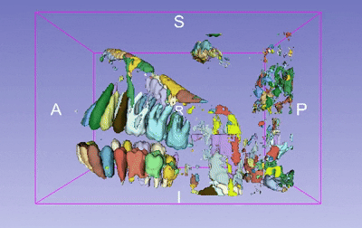
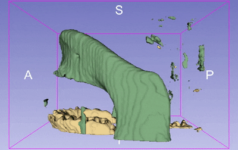
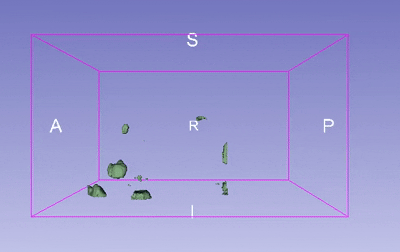

# 🦷 ToothFairy2 — Multi-Class Tooth Segmentation Pipeline

> An end-to-end 3D deep learning pipeline for automated, multi-class tooth segmentation of dental CT/CBCT volumetric scans using the MONAI framework and a 3D Residual UNet.


---

## Table of Contents

- [Overview](#overview)
- [Repository Structure](#repository-structure)
- [Dataset](#dataset)
- [Architecture](#architecture)
- [Pipeline Walkthrough](#pipeline-walkthrough)
- [Key Design Choices](#key-design-choices)
- [Output Artifacts](#output-artifacts)
- [Visualizations](#visualizations)
- [Installation & Usage](#installation--usage)
- [Dependencies](#dependencies)
- [Future Work](#future-work)

---

## Overview

This project implements a complete **3D multi-class tooth segmentation** pipeline trained on the [**ToothFairy2**](https://ditto.ing.unimore.it/toothfairy2) dataset (`Dataset112_ToothFairy2`).
The pipeline consists of three specialised sub-models, each targeting a different segmentation task:-
-   The `FDI` model performs per-tooth instance segmentation, assigning each voxel to one of 32 tooth classes (plus background) based on the FDI dental numbering scheme.
-   The `Jaw Separation` model segments the upper and lower jawbones i.e 2 classes (upper/lower) plus background.
-   The `Restoration` model identifies dental restorations such as implants, crowns, bridges merged into single class i.e. 1 class (plus background).


The pipeline is built on top of [MONAI](https://monai.io/) — a PyTorch-based framework purpose-built for medical image analysis — and covers the full workflow:

```
Data Loading → Preprocessing → Augmentation → Training → Validation → Test Inference → Saved Predictions (as NIfTI files)
```

## Repository Structure

```
ToothFairy2/
├── FDI/       
# Folder: FDI instance segmentation model + notebook + outputs
├── Jaw Separation/  
# Folder: jaw separation model + notebook + outputs
├── Restoration/            
# Folder: restoration segmentation model + notebook + outputs
├── requirements.txt        
# Python dependencies
└── README.md
```


## Dataset
    

| Property | Value |
|---|---|
| **Name** | ToothFairy2 (`Dataset112_ToothFairy2`) |
| **Format** | `.mha` (MetaImage) 3D volumetric files |
| **Modality** | Dental CT / CBCT |
| **Task** | Per-tooth instance segmentation, Jaw Separation, Restoration Segmentation |
| **Split** | 80% train / 10% validation / 10% test |

## Label Remapping

**FDI label remapping** — the original sparse FDI two-digit tooth IDs (11, 12, … 48) are remapped to contiguous integers (`0–32`) for the FDI model. This ensures the softmax output head produces a valid probability distribution across all 33 channels:

```
FDI 11–18  →  Class  1–8   (Upper Right)
FDI 21–28  →  Class  9–16  (Upper Left)
FDI 31–38  →  Class 17–24  (Lower Left)
FDI 41–48  →  Class 25–32  (Lower Right)
All others →  Class  0     (Background)
```
**Jaw Separation label remapping** — the original jaw labels (upper/lower) are remapped to contiguous integers (`0–2`) for the jaw separation model. This ensures the softmax output head produces a valid probability distribution across all 3 channels:

```
Lower Jawbone → Class 1
Upper Jawbone → Class 2
All Others → Class 0 (Background)
```
**Restoration label remapping** — the original restoration labels are remapped to a single class (`1`) for the restoration model. This ensures the softmax output head produces a valid probability distribution across all 2 channels:
```
Restorations (implants, crowns, bridges) → Class 1
All Others → Class 0 (Background)
```
---

## Architecture

### 3D Residual UNet (MONAI `UNet`)

The segmentation model is a **3-dimensional UNet with residual units**, implemented via `monai.networks.nets.UNet`.

```
Input:  [B, 1, 96, 96, 96]
         │
    ┌────▼────┐
    │ Encoder │  channels: 1 → 16 → 32 → 64 → 128 → 256
    │ ResUnits│  strides:       2    2    2    2
    └────┬────┘
         │  Skip connections at every level
    ┌────▼────┐
    │Bottleneck│  256 channels
    └────┬────┘
    ┌────▼────┐
    │ Decoder │  Symmetric upsampling + skip concatenation
    │ ResUnits│
    └────┬────┘
         │
Output: [B, Total Classes, 96, 96, 96]
```

**Key parameters:**

| Parameter | Value | Purpose |
|---|---|---|
| `spatial_dims` | 3 | Full 3D convolutions |
| `in_channels` | 1 | Single HU-scaled grayscale channel |
| `out_channels` | Total Classes | Background + individual classes |
| `channels` | `(16, 32, 64, 128, 256)` | Progressive feature expansion |
| `strides` | `(2, 2, 2, 2)` | Halves resolution at each encoder stage |
| `num_res_units` | 2 | Two residual blocks per encoder/decoder level |
| `norm` | `Norm.INSTANCE` | Instance Normalisation (stable at batch size 1–2) |

**Why residual units?** Residual (skip) connections inside each level allow gradients to flow directly backward, enabling the network to train deeper feature representations without degradation — a critical property in deep 3D networks.

**Why Instance Norm over Batch Norm?** With medical imaging, batch sizes are often 1–2 due to GPU VRAM constraints, making batch statistics unreliable. Instance Norm computes statistics per-sample per-channel and works correctly at batch size 1.

---

## Pipeline Walkthrough

### 1. Preprocessing Transforms

All transforms are composed via MONAI's `Compose`, applied in a dictionary-keyed fashion (operating on `{"image": ..., "label": ...}` pairs simultaneously):

| Step | Transform | Rationale |
|---|---|---|
| Load | `LoadImaged` | Reads `.mha` files into NumPy arrays with metadata |
| Channel | `EnsureChannelFirstd` | `[H,W,D]` → `[1,H,W,D]` |
| Label remap | `MapLabelValued` | FDI → contiguous integers |
| Intensity scale | `ScaleIntensityRanged` | Clips HU `[200, 2000]` → `[0.0, 1.0]` |
| Crop foreground | `CropForegroundd` | Removes empty border voxels |
| Orientation | `Orientationd(axcodes="RAS")` | Standardises axis orientation across scanners |
| Spacing | `Spacingd(pixdim=(0.4, 0.4, 0.4))` | Isotropic 0.4 mm voxel spacing |
| Patch crop | `RandCropByPosNegLabeld` | 96³ patches, balanced 50/50 foreground/background |
| Augmentation | `RandAffined` | Rotation ±12° and scale ±10% at 50% probability |

**HU clipping rationale:** 200 HU lower bound excludes soft tissue; 2000 HU upper bound captures dense enamel without saturation from metal artefacts.

### 2. Training

```python
# Loss: Dice Loss — robust to severe class imbalance
loss_fn = DiceLoss(to_onehot_y=True, softmax=True)

# Optimiser
optimizer = Adam(lr=1e-4)

# Metric: background class excluded to avoid inflation
metric = DiceMetric(include_background=False)
```

Training runs for **20 epochs** with validation every 2 epochs. The best model checkpoint (`best_metric_model.pth`) is saved whenever validation Dice improves.

### 3. Validation — Sliding Window Inference

Full validation volumes are too large for a single GPU forward pass. Sliding window inference tiles the volume into overlapping 96³ windows and assembles predictions using **Gaussian-weighted averaging** in overlapping regions (smoothing tiling artefacts):

```python
val_outputs = sliding_window_inference(
    val_inputs, roi_size=(96, 96, 96), sw_batch_size=4, predictor=model
)
```

### 4. Test Inference & Post-Processing

A key memory optimisation: `argmax` is applied **before** `Invertd` (upsampling back to original resolution):

```
[B, 33, H, W, D]  →  argmax  →  [B, 1, H, W, D]  →  Invertd  →  SaveImaged (.nii.gz)
```

This reduces RAM usage by ~97% on large full-skull volumes. `nearest_interp=True` is mandatory post-argmax to avoid interpolating between discrete class indices.

---

## Key Design Choices

| Decision | Rationale |
|---|---|
| 3D UNet over 2D | Dental CT is volumetric; 2D slice-by-slice loses inter-slice context essential for accurate 3D tooth boundaries |
| Isotropic 0.4 mm resampling | Consistent physical scale across scanners; captures fine root detail without excessive memory cost |
| Dice Loss over Cross-Entropy | Dental CT has extreme foreground/background imbalance; Dice directly optimises the evaluation metric |
| Instance Norm | Stable at batch sizes 1–2 where Batch Norm is unreliable |
| Balanced patch sampling | `pos=1, neg=1` ensures 50% of patches contain at least one tooth voxel, preventing "always predict background" |
| Argmax before Invertd | Collapses 33-channel output to 1 channel before upsampling, reducing RAM by ~97% |
| `num_workers=0` for test | `Invertd` is not fork-safe; main-process execution avoids deadlocks |

---

## Output Artifacts

| File | Description |
|---|---|
| `best_metric_model.pth` | Best model weights (highest validation Dice) |
| `training_metrics.png` | Training loss and validation Dice over epochs |
| `inference_visualization_N.png` | Side-by-side scan slice vs. model prediction per test patient |
| `ToothFairy2F<patient_id>.nii.gz` | Full 3D segmentation mask at original voxel spacing |

---

## Visualizations

> 3D segmentation predictions rendered in [3D Slicer](https://www.slicer.org/) on held-out test patients.

### 🦷 FDI — Per-Tooth Instance Segmentation (32 classes)

Each colour represents a distinct tooth mapped to its FDI number (classes 1–32). Background is suppressed.



---

### 🦴 Jaw Separation — Upper / Lower Jawbone Segmentation

Two-class output separating the upper jawbone (maxilla) from the lower jawbone (mandible).



---

### 🔩 Restoration — Implant / Crown / Bridge Detection

Single-class output highlighting all detected dental restorations in the scan.



---

> **Tip:** Videos can also be viewed in [3D Slicer](https://www.slicer.org/) or [ITK-SNAP](http://www.itksnap.org/) by loading the corresponding `.nii.gz` prediction files from the `predictions/` folder.

---

## Installation & Usage

### Requirements

GPU with **≥ 8 GB VRAM** recommended (tested on Kaggle T4×2).

```bash
pip install -r requirements.txt
```

`requirements.txt` installs `monai[all]`, which pulls in PyTorch, nibabel, SimpleITK, scikit-image, matplotlib, numpy, and scipy.

### Running a notebook

Open the notebook in the relevant subdirectory (`FDI/`, `Jaw Separation/`, or `Restoration/`) and set the `data_dir` variable to your local path for the ToothFairy2 dataset:

```python
data_dir = "/path/to/Dataset112_ToothFairy2"
```

Then run all cells top to bottom. Predicted segmentation masks will be saved to `predictions/` in NIfTI format (`.nii.gz`), which can be viewed in [3D Slicer](https://www.slicer.org/) or [ITK-SNAP](http://www.itksnap.org/).

---

## Dependencies

| Library | Version | Role |
|---|---|---|
| [MONAI](https://monai.io/) | ≥ 1.3 | Medical imaging transforms, UNet, metrics, inferers |
| [PyTorch](https://pytorch.org/) | ≥ 2.0 | Deep learning backend + CUDA |
| NumPy | any | Numerical operations |
| Matplotlib | any | Visualisation |

## Future Work
- Further Training for 20+ epochs to improve convergence and Dice scores for each model.
- Hyperparameter tuning (learning rate, batch size, augmentation parameters) to further boost performance.